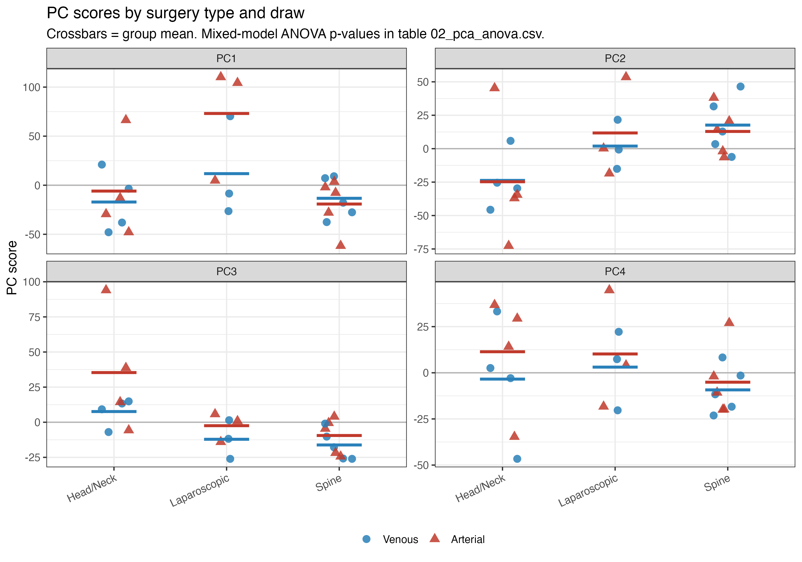
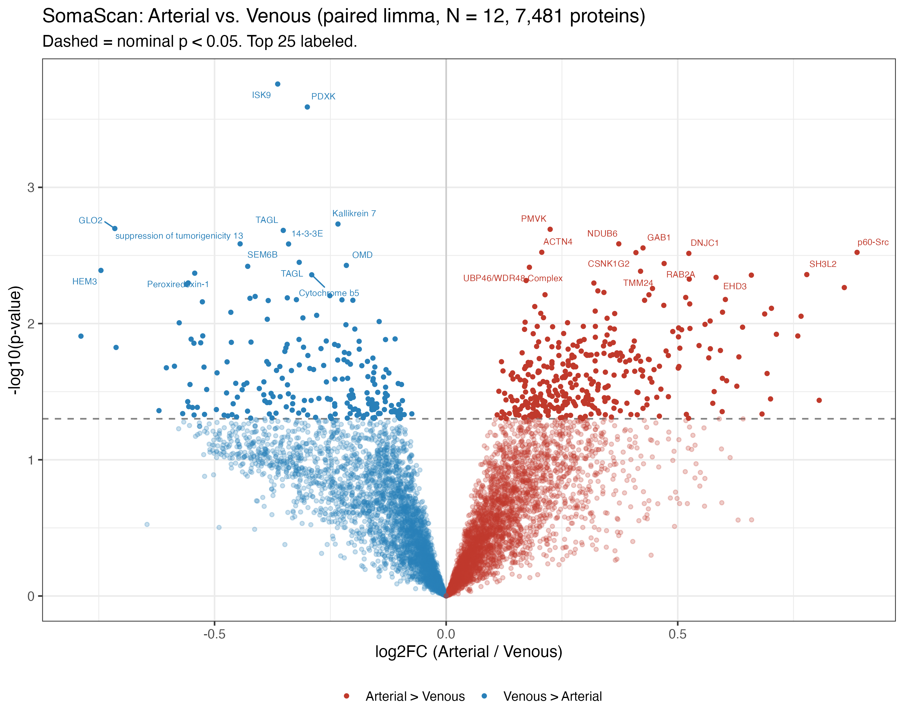
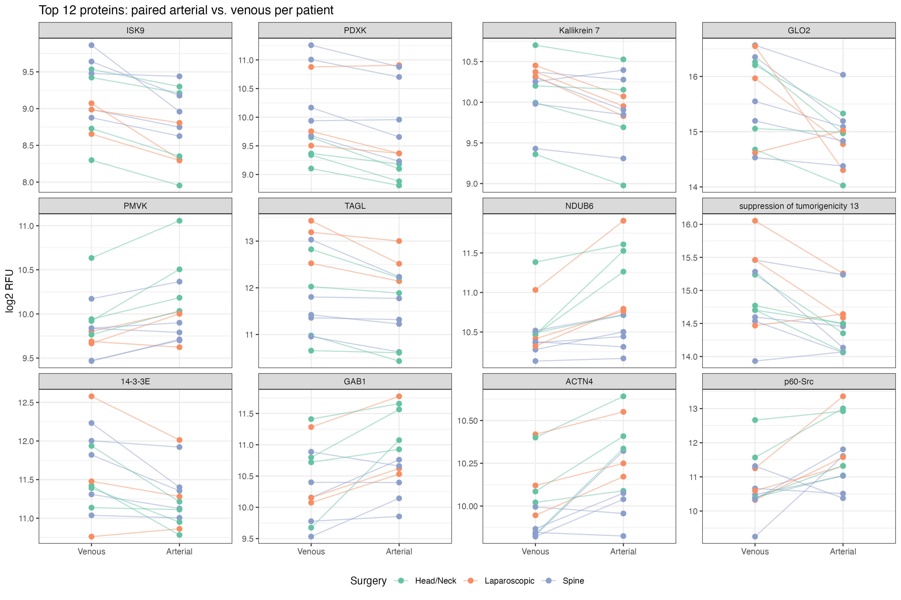
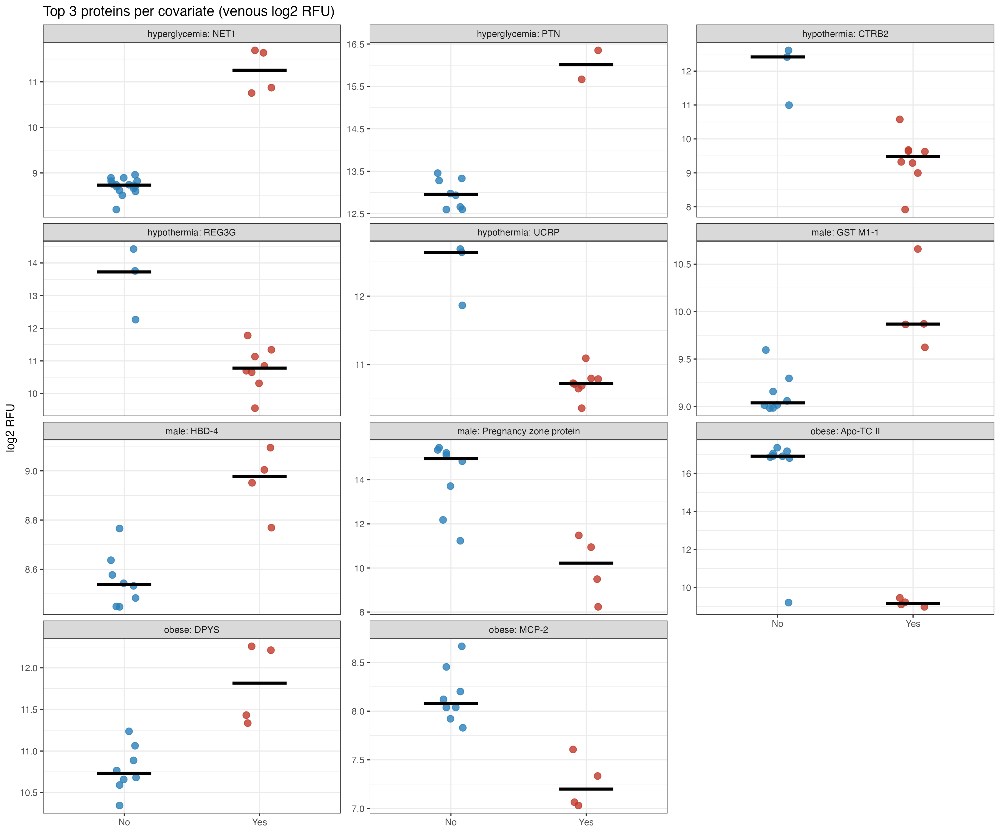
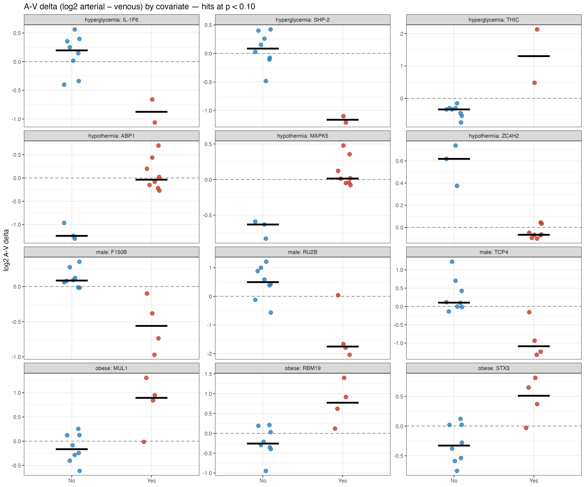

---

## Question

 **Which proteins show a systematic arteriovenous gradient under general anesthesia, in what direction, and are there patient-level factors — such as obesity, hypothermia, hyperglycemia, sex, or type of surgery — that modify it?**

---

## The Study Design

**12 patients** undergoing elective surgery at UCSF were enrolled. Each patient had a single paired blood draw — one arterial and one venous sample collected at the same time under general anesthesia, shortly after induction. No pre-operative baseline was analyzed.

Surgeries spanned three broad types:

| Surgery type | N |
|---|---|
| Spine surgery | 5 |
| Head/neck surgery (craniectomy, thyroidectomy, carotid, pituitary) | 4 |
| Laparoscopic abdominal surgery | 3 |

The samples were analyzed on two protein platforms:

- **SomaScan v4.1** — an aptamer-based platform that measured approximately 7,500 proteins simultaneously. This is the primary platform for this report.
- **Luminex 65-plex** — an antibody-based platform targeting 65 specific inflammatory cytokines, run separately as a focused panel.

---

## Sample Quality

Four of the 24 samples were flagged by SomaScan's internal quality control (patients 0193, 0245, and 0268). These samples were kept in the analysis because the normalization pipeline applied by SomaScan had already corrected for sample-level signal variation, and excluding them would eliminate entire patients from the paired comparisons. Results from those three patients should be interpreted with some caution.

---

## What Drives Variation Across All 7,500 Proteins?

First we looked at the overall structure of the data using principal component analysis (PCA). PCA compresses a dataset with thousands of variables into a small number of summary axes, each capturing a different source of variation, so you can see what the main patterns are.

The dominant source of variation in this dataset is **surgery type**. This drives the first two principal components (statistical test: p = 0.008 and p = 0.019 respectively), suggesting the proteomic profile of a spine surgery patient looks systematically different from a laparoscopic surgery patient, regardless of draw site.

The arterial-venous difference, by contrast, is a much smaller signal. It only becomes detectable on the third and fourth principal components (p ≈ 0.02 for both), which together account for about 16% of the total variance compared to 41% for the first two.

**Practical summary:** the arterial-venous signal is much smaller than other sources of variation and is embedded in a much larger background of patient-to-patient and surgery-to-surgery variation. With 12 patients, detecting individual proteins that differ is constrained by the statistical power; detecting systematic patterns across many proteins is more tractable.

---

## Which Proteins Differ Between Arterial and Venous Blood?

We tested all 7,481 proteins individually using a paired statistical model (paired limma) that compared arterial to venous within each patient. 556 proteins reached nominal statistical significance (p < 0.05). None survived correction for testing 7,481 hypotheses simultaneously — which is expected at this sample size. The results below should be treated as hypothesis-generating, not confirmatory.

Among the 556 nominally significant proteins, **345 (62%) were higher in arterial and 211 (38%) were higher in venous blood.** This 62/38 split is statistically significant (p = 1.5 × 10⁻⁸ by binomial test) and is not a chance finding — there is a genuine directional bias toward proteins being higher in the arterial circulation during the intraoperative period.

The top individual protein hits include SPINK9 (a serine protease inhibitor expressed in skin), PDXK (pyridoxal kinase), KLK7 (kallikrein-7, a skin-derived protease), and transgelin — metabolic and structural proteins rather than the classical inflammatory cytokines one might expect. These may reflect cellular stress and tissue injury at the surgical site, but without replication in a larger cohort they remain preliminary.

---

## A Skin Protease Signature at the Surgical Site

The two highest-ranked individual protein hits — SPINK9 (rank 1) and KLK7 (rank 3) — are not random: both are expressed specifically in the skin epidermis and together they belong to the kallikrein–SPINK desquamation cascade, a tightly regulated proteolytic system that governs normal skin shedding. A further four family members (SPINK1, KLK8, KLK10, SERPINA10) also reach nominal significance, all with the same directionality: **venous > arterial**, meaning the peripheral tissue is releasing them into the venous circulation rather than consuming them from the arterial supply.

The simplest interpretation is that surgical skin incision — present in every case — liberates epidermal proteins into the wound bed and thence into the venous return. This is biologically plausible: KLK7 is the principal kallikrein responsible for stratum corneum shedding; SPINK9 is its inhibitor; and together they represent a skin-surface signature rather than a deep-tissue or systemic inflammatory one. It also suggests a potential confound worth noting in any follow-up study: the A-V signal for these proteins may reflect the incision itself rather than intraoperative physiology.

---

## The Bigger Picture: Pathway Analysis

Testing proteins one at a time is underpowered at N = 12. A more powerful alternative approach is gene-set enrichment analysis (GSEA), which asks whether groups of biologically related proteins collectively shift in one direction — even when no single protein reaches significance on its own.

We ranked all 7,481 proteins from "most arterial" to "most venous" and tested whether predefined sets of biologically related proteins clustered toward one end of that ranking.

The pattern is consistent and may fit a biologic model:

**Enriched in venous blood (peripheral tissue is releasing these):**

- **Inflammatory response** — a broad set of pro-inflammatory proteins is higher returning from the surgical site than arriving in arterial blood
- **IL-6/JAK/STAT3 signaling** — a key inflammatory amplification pathway is active in the peripheral tissues during surgery
- **Allograft rejection pathway** — immune effector proteins associated with tissue damage and immune recognition
- **Coagulation** — coagulation factors are higher in venous return, consistent with local clotting activity at the surgical site
- **Epithelial-mesenchymal transition** — proteins associated with tissue remodelling are released from the surgical field

**Enriched in arterial blood (being delivered to the tissues):**

- **PI3K/AKT/mTOR signaling** — anabolic and growth-promoting signalling is higher on the arterial side
- **Protein secretion machinery** — components involved in producing and releasing proteins
- **Mitotic spindle proteins** — cell division-associated proteins

**The overall interpretation:** during the intraoperative period, peripheral tissues are actively releasing inflammatory mediators into the venous circulation. At the same time, anabolic and growth-signalling proteins are arriving from the arterial side. This might be consistent with what you would expect from an acutely injured tissue bed — it is inflamed and signalling distress, while receiving systemic support from the circulation (although this depends on whether the blood draw occurred before or after incision).

---

## Do Patient Characteristics Affect Protein Levels?

We looked at whether obesity, intraoperative hypothermia, hyperglycemia, or sex were associated with protein levels in venous blood. All findings here are hypothesis-generating only — the subgroups are very small (the hyperglycemia group, for example, had only 2 patients) and none would survive correction for multiple comparisons.

The most notable finding is not in protein levels themselves, but in the **arteriovenous gradient**: hypothermia modifies the A-V difference for over 2,000 proteins. This makes physiological sense — hypothermia slows peripheral tissue metabolism, which would reduce the rate at which tissues consume or release proteins across the capillary bed, flattening or reversing the normal A-V gradient. This deserves follow-up in a study with adequate numbers of hypothermic and normothermic patients.

---

## Comparing the Two Protein Platforms

The 65-plex Luminex panel measures 65 inflammatory cytokines using antibody-based detection. SomaScan uses a completely different technology (aptamers) to measure ~7,500 proteins. For the ~58 proteins measured by both platforms, we can check whether they agree.

**At the fold-change level** (does each platform agree on the direction of the A-V gradient?), the two platforms agree on direction for 34 of 58 proteins — barely better than chance, with a correlation of essentially zero between the platforms' effect sizes.

**At the per-patient level** (does the platform rank patients similarly within each draw type?), the agreement is similarly modest — median Spearman correlation of 0.03 across all matched proteins.

The proteins with the best cross-platform agreement are HGF (r = 0.63), CD40L (0.59), SCF (0.59), MCP-1 (0.56), and IP-10/CXCL10 (0.52). These tend to be proteins with reliable signal above the detection floors of both platforms. The majority of the 65-plex targets appear to be at concentrations too low for Luminex to detect reliably in non-septic perioperative plasma — at those levels, the two platforms are essentially measuring noise, which is why they disagree.

The one protein with strong multi-platform support for a directional A-V gradient is **IP-10/CXCL10**, which was higher in venous blood on both Luminex (p = 0.03) and SomaScan (r = 0.52). IP-10 is produced at sites of tissue inflammation in response to interferon-γ, and its presence is consistent with the GSEA finding that the inflammatory response pathway is enriched in venous return.

---

## Summary of Main Findings

**1. The arterial-venous gradient exists and is directional.** Among proteins reaching nominal significance, 62% are higher in arterial blood and 38% higher in venous — a systematic bias confirmed by binomial test (p = 1.5 × 10⁻⁸) and unlikely to be chance.

**2. A skin protease signature dominates the top individual hits.** The two highest-ranked proteins — SPINK9 (rank 1, p = 1.7 × 10⁻⁴) and KLK7 (rank 3, p = 1.9 × 10⁻³) — both belong to the kallikrein–SPINK epidermal desquamation cascade. A further three family members (KLK8, KLK10, SPINK1) also reach nominal significance, all venous > arterial. Across all 23 SPINK, KLK, and SERPIN family members measured by SomaScan, the overwhelming majority cluster toward the venous side. The most parsimonious explanation is that surgical skin incision liberates epidermal proteins into the wound bed and thence into the venous return — a skin-incision signature present across all three surgery types.

**3. Inflammation pathways cluster in venous blood at the pathway level.** The GSEA results — inflammatory response, IL-6/JAK/STAT3, coagulation, allograft rejection, epithelial-mesenchymal transition — paint a coherent picture of peripheral tissues under surgical stress releasing immune mediators into the venous return. This is the strongest and most statistically robust finding, surviving aggregation even when no single protein survives multiple-testing correction.

**4. Surgery type dominates the overall proteomic landscape.** Patient-to-patient variation and surgery type account for far more of the total proteomic variation (PC1–2) than the arterial-venous difference (PC3–4). A follow-up study restricted to a single surgery type would have substantially more power to detect individual protein-level differences.

**5. Hypothermia modifies the A-V gradient.** Hypothermic patients show altered arteriovenous gradients for thousands of proteins — including several skin protease family members — consistent with hypothermia slowing peripheral tissue metabolism and altering capillary exchange. This is the most clinically interesting secondary finding and warrants a dedicated follow-up study with adequate numbers of hypothermic patients.

**6. IP-10/CXCL10 is the most credible cross-platform finding.** It is the only protein with consistent evidence on both platforms: nominally significant on Luminex (p = 0.03), reasonable cross-platform correlation (r = 0.52 on SomaScan), and biologically plausible as a marker of interferon-γ–driven perioperative inflammation — consistent with the pathway-level finding of venous enrichment of the inflammatory response gene set.

**7. The Luminex panel is poorly suited to this cohort.** Most of the 65 targeted cytokines are at concentrations below reliable detection in non-septic perioperative plasma. For future work in this population, SomaScan or a targeted high-sensitivity aptamer panel would be more appropriate.

---

## Caveats and Next Steps

**What limits this study:** N = 12 is too small to make protein-level discoveries after correcting for multiple testing across 7,500 proteins. Subgroup analyses (obesity, hyperglycemia) have group sizes as small as n = 2 and should not be overinterpreted. The two platforms were run 10 months apart on the same samples, which likely degraded some labile cytokines and explains part of the poor cross-platform agreement.

*Prakash · Kurien · Chinn · UCSF Anesthesia & Perioperative Care · `r format(Sys.Date(), "%B %Y")`*
